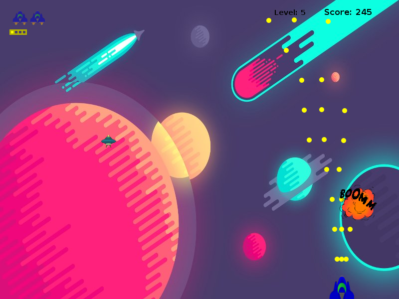

SpaceWar JavaScript
====================
  
Se esta tomando como referencia:  
Juego de [Naves de Codigo facilito](http://codigofacilito.com/cursos/Naves-HTML5, 'Naves espaciales')  
Playlist de ForeignGuyMike y su [Juego de naves](https://www.youtube.com/playlist?list=PL-2t7SM0vDffoasICG7X_6SObAW9L7hph, 'Naves espaciales ForeignGuyMike')   
  * * *
  
  
Se esta tomando como referencia el [juego hecho en Java](https://github.com/khrizenriquez/SpaceWar)

  
  
[@khrizenriquez](https://twitter.com/khrizEnriquez)